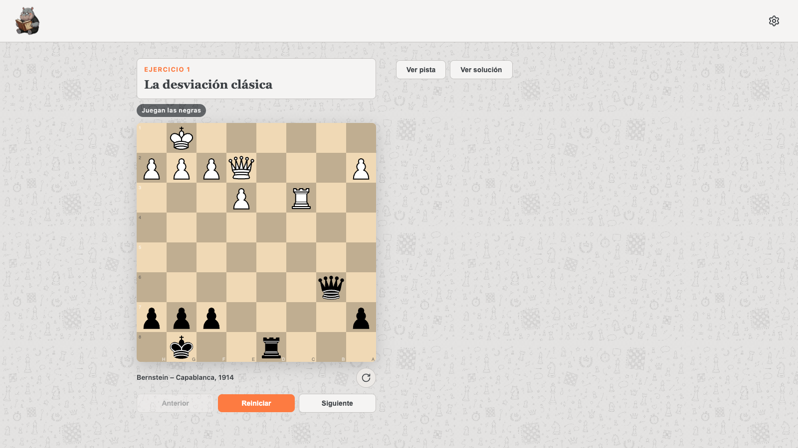
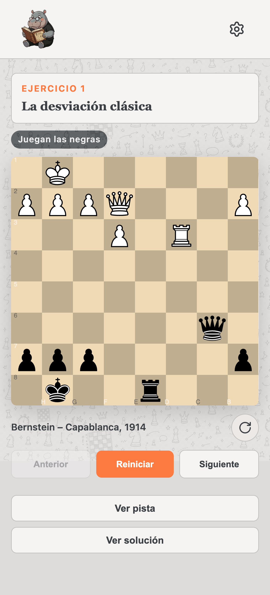

# TucuChess: ejercicios de Alburt

> Este proyecto fue codeado en forma black box con IA como proyecto personal. No es un repositorio pensado para evaluación de recruiters ni como muestra representativa de ingeniería profesional.

Aplicación web estática para practicar ejercicios tácticos de ajedrez basados en el _Chess Training Pocket Book_ de Lev Alburt. El proyecto ofrece una portada con los ejercicios disponibles y una vista interactiva para resolver cada posición directamente sobre el tablero.

## Demo

[](https://libasoles.github.io/alburt-exercises/)

[Probar demo en GitHub Pages](https://libasoles.github.io/alburt-exercises/)

## Capturas

### Desktop



### Mobile



## Qué incluye

- 7 ejercicios cargados desde un dataset local.
- Tablero interactivo con `chessground` y validación de jugadas con `chess.js`.
- Pistas y soluciones por ejercicio.
- Navegación entre ejercicios, reinicio de posición y feedback visual por jugada.
- Interfaz bilingüe (`es` / `en`).
- Dos estilos de tablero seleccionables desde el menú de configuración.

## Stack

- Vite
- JavaScript ES modules
- [`lichess-org/chessground`](https://github.com/lichess-org/chessground)
- `chess.js`
- Vitest

## Componentes y assets

- El tablero interactivo está construido sobre [`lichess-org/chessground`](https://github.com/lichess-org/chessground).
- El tema plano usa los assets `cburnett` importados desde `chessground`.
- Las piezas del tema Staunton incluidas en `public/images/staunton/` provienen de [`lichess-org/lila`](https://github.com/lichess-org/lila).

## Desarrollo

### Requisitos

- Node.js 18+
- npm

### Instalar dependencias

```bash
npm install
```

### Levantar en local

```bash
npm run dev
```

### Ejecutar tests

```bash
npm test
```

### Generar build

```bash
npm run build
```

## Publicar en GitHub Pages

El repositorio queda listo para deploy automático con GitHub Actions usando [`.github/workflows/deploy-pages.yml`](/Users/guillermoperez/Projects/playground/chess/alburt-book/.github/workflows/deploy-pages.yml). El flujo:

- se ejecuta en cada push a `main`
- instala dependencias con `npm ci`
- corre los tests
- genera `dist/`
- publica ese build en GitHub Pages

### Activación en GitHub

1. Subí el proyecto al repositorio de GitHub.
2. En `Settings > Pages`, elegí `Source: GitHub Actions`.
3. Hacé push a `main`.

La configuración de Vite ya usa `base: './'`, así que funciona bien publicado desde el subpath del repositorio en GitHub Pages.

## Estructura

```text
.
├── index.html
├── exercise.html
├── public/images/
└── src/
    ├── exercise.js
    ├── main.js
    ├── exercises/
    └── styles/
```
